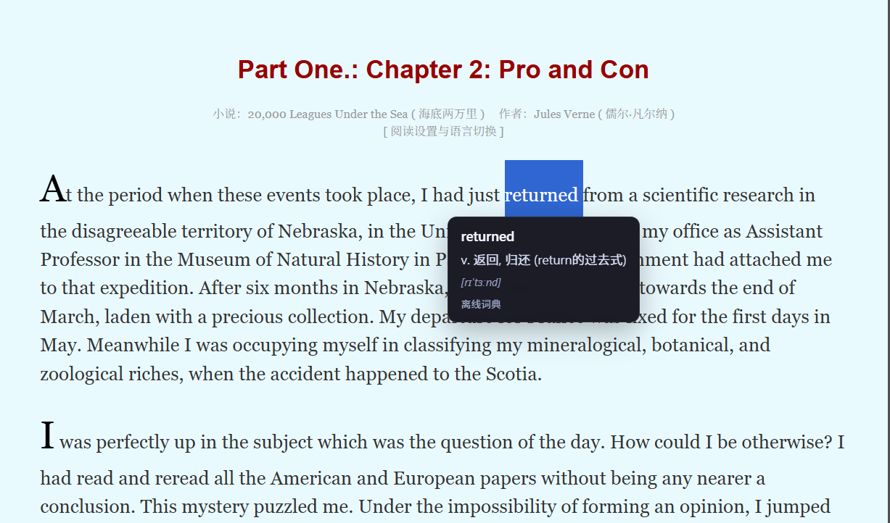

# Magnifier Translator - 双击选词即时翻译插件

Magnifier Translator 是一个浏览器扩展，用于双击或选择英文单词时显示翻译。采用离线优先的翻译模式，当离线词典查询失败时才会使用在线翻译服务。

## 项目特点

- **离线优先**：优先使用本地词典，响应速度快，支持无网络环境使用
- **精准翻译**：内置 50,000 词条的大型离线词典，覆盖常用英文单词
- **智能词形处理**：支持识别单词的复数、过去式、进行时等变形形式
- **简洁美观**：轻量级 tooltip 界面，不干扰阅读体验
- **完全免费**：无需 API Key，免费使用所有功能

## 功能特性

- 双击或选择英文单词即可触发翻译
- 优先使用离线词典，确保快速响应
- 离线词典未找到时自动回退到在线翻译
- 支持显示音标（如果词典中有音标信息）
- 可在选项页面调整目标语言（默认中文）
- 可通过弹出页面快速开启/关闭功能

## 技术栈

- React 18
- TypeScript
- Vite 5
- @crxjs/vite-plugin
- Chrome Extension Manifest V3

## 项目结构

```text
src/
├─ background/        # 后台服务（初始化设置）
├─ content/           # 核心翻译逻辑和界面
├─ options/           # 选项设置页面
├─ popup/             # 弹出控制页面
├─ utils/             # 工具函数（翻译、存储等）
└─ data/              # 离线词典文件
```

## 快速开始

### 安装依赖

```bash
npm install
```

### 构建扩展

```bash
npm run build
```

### 加载到 Chrome

1. 打开 `chrome://extensions/`
2. 启用「开发者模式」
3. 点击「加载已解压的扩展程序」
4. 选择 `dist/` 目录

## 如何使用

1. **安装扩展**：在Chrome扩展管理页面加载已解压的扩展程序
2. **启用插件**：点击插件图标确保插件已启用
3. **开始翻译**：在网页中双击或选择一个英文单词
4. **查看结果**：插件会自动显示翻译结果
5. **翻译信息**：显示原文、译文、音标（如果有）和翻译来源

## 功能演示

### 正确使用效果



### 双击翻译


### 选择翻译


### 离线词典


## 已知问题

### Edge浏览器兼容性问题
- **问题**：在Microsoft Edge浏览器中，插件只能翻译一个单词，后续单词翻译失败
- **原因**：可能与Edge浏览器的网络请求处理机制有关，Google Translate API请求在Edge中容易超时
- **临时解决方案**：
  1. 优先使用离线词典（已优化为优先加载迷你词典）
  2. 确保网络连接稳定
  3. 尝试在Chrome浏览器中使用，Chrome浏览器支持良好

### 网络请求超时
- **问题**：在线翻译请求可能会超时，特别是在网络不稳定的情况下
- **解决方案**：已添加5秒超时设置，超时后会自动使用离线词典或显示错误信息

## 后续更新计划

### 短期计划（1-2周）
1. **Edge浏览器兼容性修复**：针对Edge浏览器的网络请求处理进行优化
2. **离线词典增强**：扩充离线词典词汇量，减少对在线翻译的依赖
3. **错误处理优化**：进一步完善错误处理机制，提高插件稳定性

### 中期计划（1-2个月）
1. **多语言支持**：添加更多目标语言选项
2. **用户界面优化**：改进tooltip设计和交互体验
3. **性能优化**：进一步优化词典加载和缓存机制

### 长期计划
1. **自定义词典**：支持用户添加和管理自定义词典
2. **翻译历史**：添加翻译历史记录功能
3. **多平台支持**：尝试支持Firefox等其他浏览器
4. **发布到插件市场**：发布到Chrome Web Store和Microsoft Edge Add-ons

## 离线词典说明

- **dictionary-mini.json**：迷你词典（约 3,000 词条），启动速度快
- **dictionary-large.json**：大型词典（约 50,000 词条），覆盖范围广

插件会优先加载大型词典，只有在大型词典加载失败时才会使用迷你词典作为后备。

## 常见问题

### 翻译不显示？
- 确保选择的是单个英文单词
- 检查插件是否已启用（点击插件图标查看状态）
- 检查网络连接（如果需要在线翻译）

### 翻译不准确？
- 离线词典可能不包含所有单词，会自动回退到在线翻译
- 对于专业术语，建议使用在线翻译服务

### 插件占用内存大？
- 插件会根据设备性能自动选择合适的词典
- 大型词典约占用 25MB 内存，但提供更全面的翻译

## 测试清单

- ✅ 双击英文单词，确认翻译 tooltip 显示
- ✅ 选择英文单词，确认翻译 tooltip 显示
- ✅ 选择多个单词或中文，确认不触发翻译
- ✅ 切换目标语言，确认翻译语言变化
- ✅ 关闭插件，确认不再显示翻译
- ✅ 无网络环境下，确认离线词典正常工作

## 版本说明

### v1.0.0
- 首次发布
- 支持双击/选择单词翻译
- 内置离线词典（50,000 词条）
- 自动回退到在线翻译
- 支持音标显示
- 响应式 tooltip 定位

## 贡献

欢迎提交 Issue 和 Pull Request 来帮助改进这个项目。

## 许可证

MIT